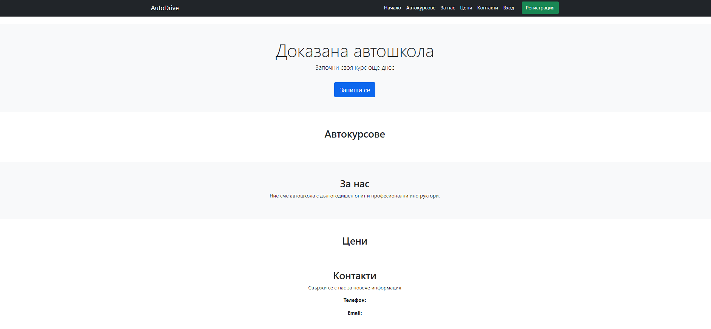
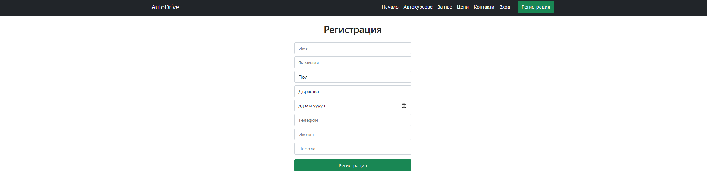

# 🚗 AutoDrive System

A full-stack **ASP.NET Core MVC (.NET 8)** application for managing a driving school workflow, including users, courses, lessons, and enrollments.

The project focuses on backend architecture, role-based access control, and relational database design using Entity Framework Core.

---

## 🎯 What this project demonstrates

- Building a real-world **role-based system (Admin / Trainer / Student)**
- Designing and managing **relational databases**
- Implementing **authentication and authorization**
- Structuring a scalable MVC web application

---

## 👥 Roles

- **Admin** – manages users, courses, and system data  
- **Trainer** – manages lessons and student progress  
- **Student** – enrolls in courses and attends lessons  

---

## 🧰 Tech Stack

- ASP.NET Core MVC (.NET 8)
- Entity Framework Core (Code First)
- PostgreSQL
- ASP.NET Identity
- Razor Views
- Bootstrap

---

## ⚙️ Core Features

### 🔐 Authentication & Authorization
- User registration and login
- Role-based access control using ASP.NET Identity

### 📚 Course Management
- Create and manage driving courses
- Assign trainers and students
- Track enrollments

### 🗓️ Lesson Management
- Schedule lessons per course
- Track lesson status and assignments

### 🗄️ Database
- Relational schema using PostgreSQL
- EF Core Code First migrations
- Proper entity relationships (Users, Courses, Lessons, Enrollments)

---

## 🧠 Engineering Highlights

- Implemented **role-based authorization system**
- Designed **relational database with multiple entity relationships**
- Applied **MVC separation of concerns**
- Built scalable structure suitable for extension (payments, analytics, etc.)

---

## 🚀 Key Challenge

The main challenge was designing and maintaining consistent relationships between users, courses, and lessons while keeping the system scalable and cleanly structured.

---

## Setup & Installation

### Clone repository
```bash
git clone https://github.com/your-username/AutoDrive-System.git
```

### Install dependencies

Using Package Manager Console:
```powershell
Install-Package Microsoft.EntityFrameworkCore -Version 8.0.4  
Install-Package Npgsql.EntityFrameworkCore.PostgreSQL -Version 8.0.4  
Install-Package Microsoft.EntityFrameworkCore.Tools -Version 8.0.4
Install-Package Microsoft.AspNetCore.Identity.EntityFrameworkCore -Version 8.0.4
Install-Package Microsoft.AspNetCore.Identity.UI -Version 8.0.4
```

### Database Migration

Create initial migration:
```powershell
Add-Migration InitialCreate 
```

Apply migration:
```powershell
Update-Database
```

### Database connection

Initialize secrets:
```powershell
dotnet user-secrets init
```

Set connection string:
```powershell
dotnet user-secrets set "ConnectionStrings:DefaultConnection" "..."
```

## Screenshots

### Home Page


### Registration Page


### Login Page

